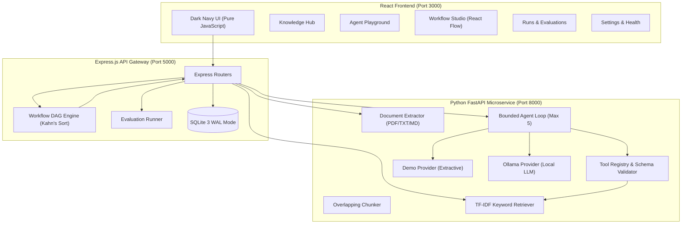

<div align="center">

# 🪐 ORBIT AI
### Local AI Engineering, Bounded Agent & Visual Workflow Automation Workspace

[](https://nodejs.org/)
[](https://fastapi.tiangolo.com/)
[](https://react.dev/)
[](https://www.sqlite.org/)
[](https://python.org/)
[](LICENSE)

<p align="center">
  <strong>A 100% free, local-first AI workspace built for AI & Data Science students and engineers.</strong><br>
  Explore genuine RAG retrieval, inspect step-by-step agent traces, and orchestrate visual DAG workflows with human-in-the-loop approvals.
</p>

[Quick Start](#-quick-start-in-3-steps) •
[Architecture](#-system-architecture) •
[Feature Tour](#-five-core-modules) •
[Demo Mode](#-two-tier-execution-demo-vs-ollama) •
[Testing](#-automated-testing) •
[Documentation](#-in-depth-documentation)

---

</div>

## 📑 Table of Contents
- [✨ Core Capabilities](#-core-capabilities)
- [🚀 Quick Start in 3 Steps](#-quick-start-in-3-steps)
- [🧩 Five Core Modules](#-five-core-modules)
  - [1. Knowledge Hub (RAG)](#1-knowledge-hub-document-rag)
  - [2. Agent Playground](#2-agent-playground-bounded-tools)
  - [3. Visual Workflow Studio](#3-visual-workflow-studio-react-flow)
  - [4. Runs & Evaluations](#4-runs--evaluations-dashboard)
  - [5. Settings & System Health](#5-settings--system-health)
- [🏗️ System Architecture](#-system-architecture)
- [💡 Two-Tier Execution (Demo vs. Ollama)](#-two-tier-execution-demo-vs-ollama)
- [🧪 Automated Testing](#-automated-testing)
- [📂 Project Directory Tree](#-project-directory-tree)
- [📖 In-Depth Documentation](#-in-depth-documentation)
- [📄 License](#-license)

---

## ✨ Core Capabilities

- 🔒 **Zero Paid Cloud APIs**: Completely functional out-of-the-box in **Demo Mode** without an OpenAI API key or expensive GPUs.
- 📐 **Transparent Mathematical RAG**: Uses pure-Python **TF-IDF + Cosine Similarity** keyword retrieval with mathematical scoring and authentic citations.
- 🛡️ **Bounded AI Agent Guardrails**: Model arguments are validated against strict JSON schemas with a hard cap of 5 tool steps per run. Arbitrary shell, database, and code execution are strictly forbidden.
- 🔀 **Visual Workflow DAGs**: Drag, connect, and execute node-based workflows using React Flow. Includes cycle detection (Kahn's algorithm).
- ⏸️ **Genuine Human-in-the-Loop Approval**: Workflows pause at approval checkpoints and resume idempotently only after explicit human sign-off.
- 📊 **Observable Run Traces**: Inspect every reasoning thought, tool input parameter, observed result, and latency metric down to the millisecond.
- 🚫 **Strictly No TypeScript**: Implemented in clean, modern JavaScript ES modules (`.jsx` / `.js`) and Python 3.11+.

---

## 🚀 Quick Start in 3 Steps

### Prerequisites
- **Node.js** (v18+ or v22 LTS)
- **Python** (v3.11+)
- *(Optional for Ollama Mode)* [Ollama](https://ollama.com/) for running local LLMs:
  ```powershell
  winget install Ollama.Ollama
  ollama serve
  ollama pull llama3
  ```

---

### Step 1: Clone & Configure

```powershell
# Clone the repository
git clone https://github.com/omkhade75/prototype.git
cd prototype

# Copy the sample environment file
Copy-Item .env.example .env
```

---

### Step 2: Install Dependencies

```powershell
# 1. Install Backend Dependencies (Node.js)
cd backend
npm install
cd ..

# 2. Install Frontend Dependencies (React & React Flow)
cd frontend
npm install
cd ..

# 3. Install Python AI Microservice Packages
cd ai-service
pip install -r requirements.txt
cd ..
```

---

### Step 3: Launch Services (Open 3 Terminals)

<table>
<tr>
<th>Terminal 1: Python AI Service (:8000)</th>
<th>Terminal 2: Express Backend (:5000)</th>
<th>Terminal 3: Vite Frontend (:3000)</th>
</tr>
<tr>
<td>

```powershell
.\start-ai-service.ps1
```
*(Or `uvicorn app.main:app --port 8000`)*

</td>
<td>

```powershell
.\start-backend.ps1
```
*(Or `cd backend; npm start`)*

</td>
<td>

```powershell
.\start-frontend.ps1
```
*(Or `cd frontend; npm run dev`)*

</td>
</tr>
</table>

🎉 Open your browser at **[http://localhost:3000](http://localhost:3000)**!

---

## 🧩 Five Core Modules

<details open>
<summary><h3>1. Knowledge Hub (Document RAG)</h3></summary>

- **Ingestion**: Upload `.pdf`, `.txt`, and `.md` files up to 10MB.
- **Authentic Page Preservation**: Preserves true page numbers from PDFs without fabrication.
- **Chunking**: Overlapping sliding-window chunker (500-char window, 100-char overlap).
- **Retrieval**: Pure Python TF-IDF with inverted term index and cosine similarity vector matching.
- **Grounded Q&A**: Answers are strictly grounded in retrieved passages with verifiable citations (Document ID, Page Number, Chunk ID, TF-IDF Score).

```
Query: "What is WAL mode in SQLite?"
 ├── TF-IDF Vectorization & Inverted Index Matching
 ├── Matched Chunk #2 (Page 1) — Score: 0.4422 [Matched: "sqlite", "wal", "mode"]
 └── Grounded Answer + Source Passage Badges
```
</details>

<details open>
<summary><h3>2. Agent Playground (Bounded Tools)</h3></summary>

Interact with an autonomous agent with complete visibility into its internal reasoning:

- **Strict Tool Registry**:
  - `search_knowledge_base`: Queries uploaded document corpus using TF-IDF.
  - `summarize_document`: Produces an extractive summary of specified document IDs.
  - `generate_quiz`: Generates multi-choice quizzes based on retrieved topics.
  - `structured_result`: Formats structured JSON analysis with key takeaways.
- **Guardrails**: Hard limit of 5 steps per run; validated argument schemas; no arbitrary shell/code execution.

</details>

<details open>
<summary><h3>3. Visual Workflow Studio (React Flow)</h3></summary>

Build and execute node-based DAGs:

| Node Type | Function |
| :--- | :--- |
| **Input** | Accepts user text or structured parameters |
| **Knowledge Search** | Queries the knowledge base and fetches top-K passages |
| **AI Task** | Executes `summarize`, `extract`, or `transform` |
| **Condition** | Evaluates comparisons (`equals`, `contains`, `is_not_empty`) |
| **Human Approval** | **Pauses execution** with status `waiting_for_approval` until authorized |
| **Output** | Stores and displays the final executed pipeline payload |

> 💡 **Preloaded Workflows Included**:
> 1. *Document Knowledge Search & Summary*: `Input -> Knowledge Search -> AI Summary -> Output`
> 2. *Structured Extraction with Human Approval*: `Input -> AI Extraction -> Human Approval -> Output`

</details>

<details>
<summary><h3>4. Runs & Evaluations Dashboard</h3></summary>

- **Execution Trace Viewer**: Inspect run latency, timestamps, status (`running`, `successful`, `failed`, `waiting_for_approval`), and step-by-step inputs/outputs.
- **Deterministic Evaluation Suite**: Measures real performance against 4 automated tests:
  1. *Knowledge Retrieval Grounding*
  2. *Missing Information Rejection (Zero-Match Fallback)*
  3. *Tool Argument Schema Validation*
  4. *Human Approval State Transition & Idempotency*

</details>

<details>
<summary><h3>5. Settings & System Health</h3></summary>

- Real-time service connectivity checks for Express API Gateway, SQLite, and Python FastAPI.
- Configured AI provider status and Ollama reachability monitor.
- Zero credential exposure — no secret API keys displayed.

</details>

---

## 🏗️ System Architecture



---

## 💡 Two-Tier Execution: Demo vs. Ollama

ORBIT AI features an explicit dual-tier runtime selectable directly from the **Agent Playground**:

| Feature | Demo Mode (Default) | Ollama Mode (Phase 2 Native Local LLM) |
| :--- | :--- | :--- |
| **Hardware Required** | Standard laptop / low-spec CPU | GPU or modern CPU for local LLM inference |
| **Dependencies** | Pure Python 3.11+ | Ollama daemon (`ollama serve`) |
| **Active Model** | Deterministic Grounded Engine | `llama3`, `mistral`, `phi3`, `qwen2.5` |
| **Tool Calling Method** | Semantic intent parser & rule dispatch | Native `POST /api/chat` with OpenAI-standard function calling schemas |
| **Cost** | **$0.00 (100% Free)** | **$0.00 (100% Free Local)** |
| **Bounding Limit** | Strict 5 tool calls maximum | Strict 5 tool calls maximum |
| **Schema Validation** | Strict JSON schema verification | Strict JSON schema verification before each dispatch |
| **Offline Handling** | Always available | Clear failure reporting with diagnostics (No silent fallback!) |
| **Response Label** | Explicitly tagged `demo` | Tagged with real model name (`llama3`) |

### How Local Ollama Tool Calling Works:
1. When you select **Ollama Mode** and submit a prompt, `AgentExecutor` queries the local Ollama daemon at `http://localhost:11434/api/chat`.
2. All available tool definitions are sent using the OpenAI function-calling schema generated by `tool_registry.get_ollama_tools()`.
3. If the model chooses to call a tool, its arguments are validated against the schema and executed locally in Python against the SQLite knowledge chunks.
4. The tool observation is passed back to Ollama in a conversational turn (`role: "tool"`), allowing the model to synthesize a grounded final response.
5. Every reasoning thought, parameter payload, execution duration, and citation is preserved in SQLite and rendered in the real-time execution trace.

---

## 🧪 Automated Testing

ORBIT AI includes an automated test runner executing both Python (32 tests) and Node.js (13 tests) suites:

```powershell
.\run-tests.ps1
```

```
======================================================
   ORBIT AI: Running Comprehensive Automated Tests    
======================================================

[1/2] Running Python FastAPI Service Tests (pytest)...
ai-service/tests/test_agent_tools.py ......................... PASSED [ 18%]
ai-service/tests/test_ollama_agent.py ........................ PASSED [ 43%]
ai-service/tests/test_quiz_generator.py ...................... PASSED [ 65%]
ai-service/tests/test_rag.py ................................. PASSED [100%]
============================= 32 passed in 0.35s ==============================

[2/2] Running Node.js Express Backend Tests (node --test)...
# Subtest: Agent Service Schema & Persistence Unit Tests
    ok 1 - agent_runs table supports model and provider fields
    ok 2 - getAllRuns includes model and provider fields
# Subtest: Database Schema & Seeding Test
    ok 1 - documents table exists and contains seeded record
    ok 2 - document chunks are seeded with positive token count
    ok 3 - sample workflows exist in workflow_definitions
# Subtest: Evaluation Service Integration Test
    ok 1 - evaluations table stores and retrieves historical evaluation suites
# Subtest: Workflow Engine DAG Validation & Execution Test
    ok 1 - valid acyclic graph passes validation
    ok 2 - cyclic graph is rejected with cycle error
    ok 3 - unsupported node type is rejected
# pass 13, fail 0 in 296ms

All ORBIT AI test suites passed with 100% success!
```

---

## 📂 Project Directory Tree

```
orbit-ai/
├── frontend/             # React application (Vite, JavaScript JSX, CSS)
├── backend/              # Node.js Express backend (ES Modules)
│   ├── src/database/     # SQLite schema, WAL connection, and sample seed data
│   ├── src/services/     # Workflow DAG engine, document storage, eval runner
│   └── storage/uploads/  # Physical file upload directory
├── ai-service/           # Python 3.11+ FastAPI service
│   ├── app/rag/          # Document extractor, text chunker, TF-IDF retriever
│   ├── app/tools/        # Bounded tool registry with JSON argument validation
│   └── app/agents/       # Bounded agent loop with trace logging
├── docs/                 # Architectural specifications, API guides, learning guide
├── tests/                # Automated integration test runners
├── run-tests.ps1         # PowerShell test script
├── start-ai-service.ps1  # Launch script for FastAPI microservice (:8000)
├── start-backend.ps1     # Launch script for Express API gateway (:5000)
├── start-frontend.ps1    # Launch script for React Vite frontend (:3000)
├── .env.example          # Environment variables template
└── .gitignore            # Excludes node_modules, .venv, *.db, logs, caches
```

---

## 📖 In-Depth Documentation

Explore the detailed educational guides in the [`docs/`](docs/) directory:

- 🏛️ **[System Architecture](docs/ARCHITECTURE.md)**: Comprehensive deep dive into the 3-tier decoupled design, data flow diagrams, and SQLite schema.
- 📡 **[API Reference Guide](docs/API_GUIDE.md)**: Complete REST endpoint documentation with request and response payloads.
- 🎓 **[Student Learning Guide](docs/LEARNING_GUIDE.md)**: Request lifecycles, the mathematical foundations of TF-IDF vectors, agent guardrails, and debugging strategies.
- 🗺️ **[Learning Roadmap](docs/ROADMAP.md)**: Next steps for scaling from this prototype to Qdrant, LangGraph, Promptfoo, MCP servers, and Docker.

---

## 📄 License

This project is licensed under the [MIT License](LICENSE). Built for learning, experimentation, and local AI engineering.
