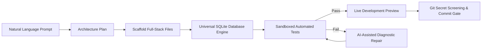
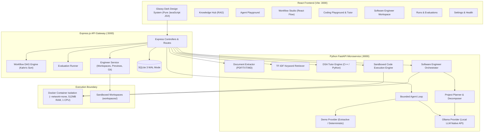

<div align="center">

# 🪐 ORBIT AI
### Local AI Engineering, Coding Tutor, Software Engineer Agent & Visual Workflow Automation

[](https://nodejs.org/)
[](https://fastapi.tiangolo.com/)
[](https://react.dev/)
[](https://www.sqlite.org/)
[](https://python.org/)
[](https://www.docker.com/)
[](LICENSE)

<p align="center">
  <strong>A 100% free, local-first AI engineering workstation built for computer science students and developers.</strong><br>
  Explore genuine RAG retrieval, bounded local agents, interactive C++/Python DSA tutoring, and an autonomous AI Software Engineer that builds real full-stack web applications with genuine SQLite databases.
</p>

[Quick Start](#-quick-start-in-3-steps) •
[Architecture](#-system-architecture) •
[Feature Tour](#-core-modules) •
[Ollama & Demo Runtime](#-two-tier-execution-demo-vs-ollama) •
[Testing](#-automated-testing) •
[Docker Sandbox Setup](#-docker-sandboxing--security)

---

</div>

## 📑 Table of Contents
- [✨ Core Capabilities](#-core-capabilities)
- [🚀 Quick Start in 3 Steps](#-quick-start-in-3-steps)
- [🧩 Core Modules](#-core-modules)
  - [1. Knowledge Hub (Document RAG)](#1-knowledge-hub-document-rag)
  - [2. Agent Playground (Bounded Tool Calling)](#2-agent-playground-bounded-tool-calling)
  - [3. Visual Workflow Studio (React Flow)](#3-visual-workflow-studio-react-flow)
  - [4. Coding Playground & DSA Tutor](#4-coding-playground--dsa-tutor-c--python)
  - [5. PDF-Based DSA Tutor & Mastery Dashboard](#5-pdf-based-dsa-tutor--mastery-dashboard)
  - [6. ORBIT AI Software Engineer Agent](#6-orbit-ai-software-engineer-agent)
  - [7. Runs, Evaluations & System Health](#7-runs-evaluations--system-health)
- [🏗️ System Architecture](#-system-architecture)
- [💡 Two-Tier Execution: Demo vs. Ollama](#-two-tier-execution-demo-vs-ollama)
- [🛡️ Docker Sandboxing & Security](#-docker-sandboxing--security)
- [🧪 Automated Testing](#-automated-testing)
- [📂 Project Directory Tree](#-project-directory-tree)
- [📄 License](#-license)

---

## ✨ Core Capabilities

- 🔒 **Zero Paid Cloud APIs**: 100% functional out-of-the-box in **Demo Mode** without an OpenAI API key, cloud credits, or paid subscriptions.
- 🦙 **Native Ollama Local AI Integration**: Seamless connection to local LLMs (`llama3`, `mistral`, `qwen2.5`, `phi3`) with real function calling and strictly **zero silent fallback**.
- 🛠️ **Autonomous AI Software Engineer**: Translates natural-language project specifications into runnable full-stack web applications with genuine SQLite databases, automated test suites, and live development previews.
- 🎓 **Interactive C++ & Python DSA Tutor**: Learn, debug, and practice LeetCode and Data Structures & Algorithms with structured explanations, pseudocode, line-by-line walk-throughs, and dry-run traces.
- 📄 **PDF-Grounded Learning**: Ingest DSA textbooks and university lecture notes; learn directly from specific sections with page-aware citations.
- 🐳 **Secure Container Sandboxing**: Enforces Docker container execution with `--network=none`, `-m 512m`, `--cpus 1.0`, `--pids-limit 64`, and dropped capabilities.
- 📐 **Transparent Mathematical RAG**: Pure-Python **TF-IDF + Cosine Similarity** keyword retrieval with verifiable scoring and citations.
- 🔀 **Visual Workflow DAGs**: Drag, connect, and execute node-based workflows using React Flow with Kahn's topological sort and genuine human-in-the-loop approvals.
- 🚫 **Strictly No TypeScript**: Implemented purely in clean JavaScript (React JSX, Node.js ES Modules) and Python 3.11+.

---

## 🚀 Quick Start in 3 Steps

### Prerequisites
- **Node.js** (v18+ or v22 LTS recommended)
- **Python** (v3.11+)
- *(Optional for Ollama Mode)* [Ollama](https://ollama.com/) for local model inference:
  ```powershell
  winget install Ollama.Ollama
  ollama serve
  ollama pull llama3
  ```
- *(Optional for Sandboxed Execution)* [Docker Desktop](https://www.docker.com/) for container-isolated test runs.

---

### Step 1: Clone & Configure

```powershell
git clone https://github.com/omkhade75/prototype.git
cd prototype
Copy-Item .env.example .env
```

---

### Step 2: Install Dependencies

```powershell
# 1. Install Backend Dependencies (Node.js)
cd backend
npm install
cd ..

# 2. Install Frontend Dependencies (React & Vite)
cd frontend
npm install
cd ..

# 3. Install Python AI Microservice Packages
cd ai-service
pip install -r requirements.txt
cd ..
```

---

### Step 3: Launch Services (Open 3 Terminals)

<table>
<tr>
<th>Terminal 1: Python AI Service (:8000)</th>
<th>Terminal 2: Express Backend (:5000)</th>
<th>Terminal 3: Vite Frontend (:3000)</th>
</tr>
<tr>
<td>

```powershell
.\start-ai-service.ps1
```
*(Or `uvicorn app.main:app --port 8000`)*

</td>
<td>

```powershell
.\start-backend.ps1
```
*(Or `cd backend; npm start`)*

</td>
<td>

```powershell
.\start-frontend.ps1
```
*(Or `cd frontend; npm run dev`)*

</td>
</tr>
</table>

🎉 Open your browser at **[http://localhost:3000](http://localhost:3000)**!

---

## 🧩 Core Modules

<details open>
<summary><h3>1. Knowledge Hub (Document RAG)</h3></summary>

- **Ingestion**: Upload `.pdf`, `.txt`, and `.md` files up to 10MB.
- **Authentic Page Preservation**: Preserves true page numbers from PDFs without fabrication.
- **Chunking**: Overlapping sliding-window chunker (500-char window, 100-char overlap).
- **Retrieval**: Pure Python TF-IDF with inverted term index and cosine similarity vector matching.
- **Grounded Q&A**: Answers are strictly grounded in retrieved passages with verifiable citations (Document ID, Page Number, Chunk ID, TF-IDF Score).

```
Query: "What is WAL mode in SQLite?"
 ├── TF-IDF Vectorization & Inverted Index Matching
 ├── Matched Chunk #2 (Page 1) — Score: 0.4422 [Matched: "sqlite", "wal", "mode"]
 └── Grounded Answer + Source Passage Badges
```
</details>

<details open>
<summary><h3>2. Agent Playground (Bounded Tool Calling)</h3></summary>

Interact with an autonomous agent with complete visibility into its step-by-step reasoning trace:

- **Strict Tool Registry**:
  - `search_knowledge_base`: Queries uploaded document corpus using TF-IDF.
  - `summarize_document`: Produces an extractive summary of specified document IDs.
  - `generate_quiz`: Generates multi-choice quizzes based on retrieved topics.
  - `structured_result`: Formats structured JSON analysis with key takeaways.
- **Guardrails**: Hard limit of 5 steps per run; validated argument schemas; no arbitrary shell/code execution.
- **Observability**: Inspect timing, raw model inputs, tool parameters, observations, and citations.

</details>

<details open>
<summary><h3>3. Visual Workflow Studio (React Flow)</h3></summary>

Build and execute node-based DAG pipelines:

| Node Type | Function |
| :--- | :--- |
| **Input** | Accepts user text or structured parameters |
| **Knowledge Search** | Queries the knowledge base and fetches top-K passages |
| **AI Task** | Executes `summarize`, `extract`, or `transform` |
| **Condition** | Evaluates comparisons (`equals`, `contains`, `is_not_empty`) |
| **Human Approval** | **Pauses execution** with status `waiting_for_approval` until explicit sign-off |
| **Output** | Stores and displays the final executed pipeline payload |

> 💡 **Includes DAG Cycle Detection** using Kahn's topological sort algorithm and persistent SQLite state.

</details>

<details open>
<summary><h3>4. Coding Playground & DSA Tutor (C++ & Python)</h3></summary>

An IDE-style programming and algorithmic learning environment:

- **Bilingual Support**: Toggle between **C++17** and **Python 3.11** with preloaded idiomatic templates.
- **4 Tutor Pedagogical Modes**:
  1. **Learn**: Deep concept exploration, memory layout diagrams, edge cases, and visual mental models.
  2. **Build With Me**: Interactive scaffolded problem solving with hints and approach selection.
  3. **Debug**: Automated diagnostic analysis identifying syntax bugs, off-by-one errors, and segmentation faults.
  4. **Practice**: Real LeetCode problem prompts with verified official links, constraints, and test cases.
- **Structured Explanations**:
  - Problem Understanding & Invariants
  - Approach Comparison (Brute Force vs. Optimal)
  - Pseudocode
  - Formatted Solution Code
  - Line-by-Line Code Walkthrough
  - Step-by-Step Dry Run Table
  - Time & Space Complexity ($O(N)$, $O(1)$)
- **DSA Topic Browser**: Arrays, Strings, Hashing, Linked Lists, Stacks, Queues, Binary Search, Trees, Graphs, and Dynamic Programming.

</details>

<details open>
<summary><h3>5. PDF-Based DSA Tutor & Mastery Dashboard</h3></summary>

Learn Data Structures and Algorithms directly from your uploaded university textbooks or PDFs:

- **Document Grounding**: Select any uploaded textbook (e.g. *CLRS*, *Grokking Algorithms*, lecture notes) to index chapters and topics.
- **Personalized Mastery Dashboard**:
  - Live mastery percentage calculation based on independent problem solves.
  - Active topic tracker with difficulty readiness metrics.
  - Socratic hint counter and quiz performance history.
  - Targeted revision alerts triggered when diagnostic quiz scores fall below threshold.

</details>

<details open>
<summary><h3>6. ORBIT AI Software Engineer Agent</h3></summary>

An autonomous local development agent that creates real, runnable full-stack web applications:



- **Authentic Dual-Engine Planning**:
  - **Ollama Mode**: Local model inference generates custom architectures, database schemas, and REST endpoints for arbitrary domains (e.g., *Drone Telemetry*, *Greenhouse Climate Control*, *Fitness Trackers*).
  - **Demo Mode**: Dynamic NLP entity extraction parses arbitrary prompts into database tables and Express routes.
  - **Clarification Gate**: Halts and prompts the user if the initial specification is ambiguous or underspecified.
- **Real SQLite Database Persistence**:
  - Generates actual binary `.db` files on disk (`SQLite format 3\0`) using Node 22+ native `node:sqlite` or `better-sqlite3`.
  - Implements real SQL DDL (`CREATE TABLE`), foreign keys, and parameterized queries (`SELECT`, `INSERT`, `DELETE`).
- **Container Isolation & Sandboxed Command Runner**:
  - Enforces Docker container isolation (`node:20-alpine`, `-m 512m`, `--cpus 1.0`, `--pids-limit 64`, `--cap-drop=ALL`, `--network=none`).
  - Refuses untrusted host execution if Docker is offline, unless explicit development host override is authorized with visible audit warnings.
- **Live Preview Management**: Starts and monitors child development servers on dynamic ports with real-time streaming logs.
- **Safe Git Operations**:
  - Pre-commit secret screening scans for API keys, private keys, `.env` files, and database binaries.
  - Requires explicit human approval for commits and remote pushes.
  - Confined strictly to `workspaces/<project_id>/`—never touches ORBIT AI's root repository.

</details>

<details>
<summary><h3>7. Runs, Evaluations & System Health</h3></summary>

- **Execution Trace Viewer**: Inspect run latency, timestamps, status (`running`, `successful`, `failed`, `waiting_for_approval`), and step-by-step inputs/outputs.
- **Deterministic Evaluation Suite**: Measures real performance against automated benchmarks:
  1. *Knowledge Retrieval Grounding*
  2. *Missing Information Rejection (Zero-Match Fallback)*
  3. *Tool Argument Schema Validation*
  4. *Human Approval State Transition & Idempotency*
- **Real-Time Health Monitor**: Live connectivity status for the Express API gateway, SQLite database, Python AI microservice, and local Ollama daemon.

</details>

---

## 🏗️ System Architecture



---

## 💡 Two-Tier Execution: Demo vs. Ollama

ORBIT AI features an explicit dual-tier runtime selectable across the Agent Playground, Coding Tutor, and Software Engineer Agent:

| Feature | Demo Mode (Default) | Ollama Mode (Native Local AI) |
| :--- | :--- | :--- |
| **Hardware Required** | Standard laptop / low-spec CPU | GPU or modern CPU for local inference |
| **Dependencies** | Pure Python 3.11+ | Local Ollama daemon (`ollama serve`) |
| **Active Model** | Deterministic Grounded Engine | `llama3`, `mistral`, `qwen2.5`, `phi3` |
| **Cost** | **$0.00 (100% Free)** | **$0.00 (100% Free Local)** |
| **Software Engineer** | Dynamic entity extraction for arbitrary prompts | Local LLM structured architecture & schema generation |
| **Offline Handling** | Always available | Clear failure reporting with diagnostics (**No silent fallback**) |
| **Response Label** | Explicitly tagged `demo` | Tagged with real model name (`llama3`) |

---

## 🛡️ Docker Sandboxing & Security

Untrusted user code and generated full-stack applications run with strict isolation:

* **Container Isolation**:
  ```bash
  docker run --rm \
    --network=none \
    -m 512m \
    --cpus 1.0 \
    --pids-limit 64 \
    --cap-drop=ALL \
    -v "/path/to/workspace:/workspace:rw" \
    -w /workspace \
    node:20-alpine npm test
  ```
* **Resource Quotas**: Hard-capped at 512MB RAM, 1.0 CPU core, 64 processes/threads, and 30-second execution timeouts.
* **Network Isolation**: Complete network disconnection (`--network=none`) prevents data exfiltration and external calls.
* **Volume Isolation**: Only the active project directory is mounted. Host operating system files and Docker sockets are never exposed.
* **Dockerless Environments**: If Docker is not present, untrusted execution is refused with clear setup instructions. An explicit development override flag (`allow_host_override=true`) is available for local testing, recording visible security warnings.

For detailed Docker setup instructions, see [`docs/DOCKER_SANDBOX_SETUP.md`](docs/DOCKER_SANDBOX_SETUP.md).

---

## 🧪 Automated Testing

ORBIT AI includes automated test suites across the Python AI service, Node.js backend, and generated workspaces:

```powershell
.\run-tests.ps1
```

### Test Suite Summary

1. **Python FastAPI Service (77 Tests)**:
   ```powershell
   python -m pytest ai-service/tests
   ```
   * RAG extraction, chunking, and TF-IDF mathematical retrieval.
   * Agent tool registry and bounded step enforcement.
   * C++ and Python code runner sandbox and test harness.
   * DSA tutor pedagogy and PDF topic identification.
   * Ollama native function calling and offline refusal.
   * Software Engineer path canonicalization, command allowlisting, secret screening, and real SQLite persistence.

2. **Node.js Express Backend (38 Tests)**:
   ```powershell
   node --test backend/tests/*.test.js
   ```
   * SQLite WAL database schema and seeding.
   * Workflow DAG validation and Kahn's topological cycle detection.
   * Evaluation runner and human-in-the-loop approval transitions.
   * Coding service proxying and runner status.
   * Software engineer workspace lifecycle, path traversal denial, and git secret screening.
   * Docker isolation refusal and genuine binary SQLite persistence (`SQLite format 3\0`).

3. **Generated Project Integration Test (5 Tests)**:
   ```powershell
   cd workspaces/restaurant-management
   node --test tests/api.test.js
   ```
   * Verifies real binary SQLite `.db` file exists with genuine header.
   * Validates SQL DDL schema initialization.
   * Tests real SQL queries, inserts, deletes, and aggregate functions (`SUM`, `COUNT`).

4. **Frontend Production Build**:
   ```powershell
   cd frontend
   npm run build
   ```
   * Clean production build via Vite (0 errors, 2.3s build time).

---

## 📂 Project Directory Tree

```
orbit-ai/
├── frontend/             # React application (Vite, JavaScript JSX, Glassy CSS)
│   ├── src/pages/        # KnowledgeHub, AgentPlayground, WorkflowStudio,
│   │                     # CodingPlayground, SoftwareEngineer, Evaluations, Settings
│   └── src/components/   # Navigation Sidebar, Glassy Cards, Test Result Viewers
├── backend/              # Node.js Express API Gateway (ES Modules)
│   ├── src/database/     # SQLite schema (WAL mode) and seed data
│   ├── src/services/     # Workflow DAG engine, engineerService, codingService
│   ├── src/controllers/  # Express REST API controllers
│   ├── src/routes/       # Express API routes
│   └── tests/            # Automated Node.js unit and integration tests
├── ai-service/           # Python 3.11+ FastAPI microservice
│   ├── app/rag/          # PDF/TXT extractor, text chunker, TF-IDF retriever
│   ├── app/tools/        # Bounded tool registry with JSON argument validation
│   ├── app/agents/       # Bounded agent loop with trace logging
│   ├── app/coding/       # DSA topic catalog, tutor pedagogy, C++/Python runner
│   ├── app/engineer/     # Software Engineer agent, planner, scaffolder, command runner
│   ├── app/models/       # OllamaProvider (Local LLM) and DemoProvider
│   └── tests/            # Automated pytest test suites (77 tests)
├── workspaces/           # Isolated project workspaces generated by the AI Engineer
│   └── restaurant-management/ # Reference generated project with real SQLite
├── docs/                 # Architectural specifications, API guides, Docker setup
│   └── DOCKER_SANDBOX_SETUP.md
├── run-tests.ps1         # PowerShell automated test runner
├── start-ai-service.ps1  # Launch script for FastAPI microservice (:8000)
├── start-backend.ps1     # Launch script for Express API gateway (:5000)
├── start-frontend.ps1    # Launch script for React Vite frontend (:3000)
├── .env.example          # Environment variables template
└── .gitignore            # Excludes node_modules, *.db, .venv, dist, caches
```

---

## 📄 License

This project is licensed under the [MIT License](LICENSE). Built for learning, experimentation, and local AI engineering.
