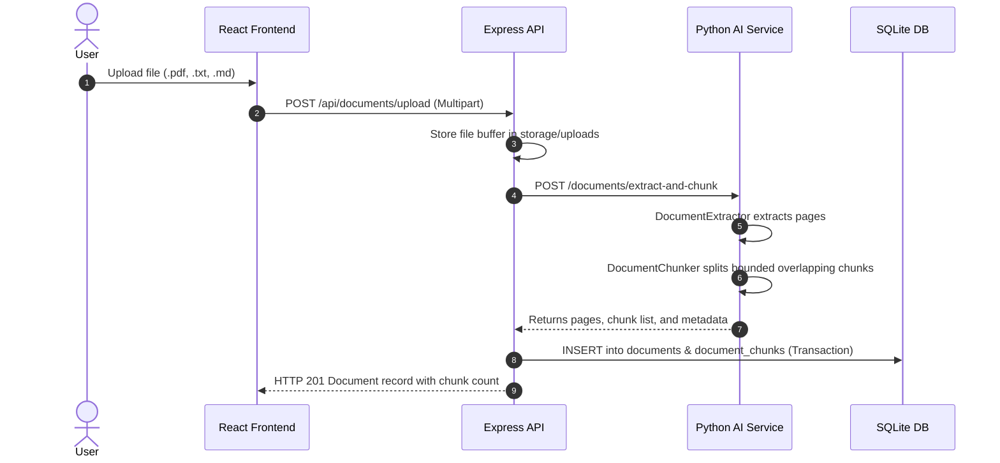
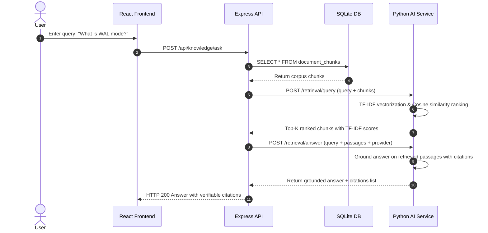
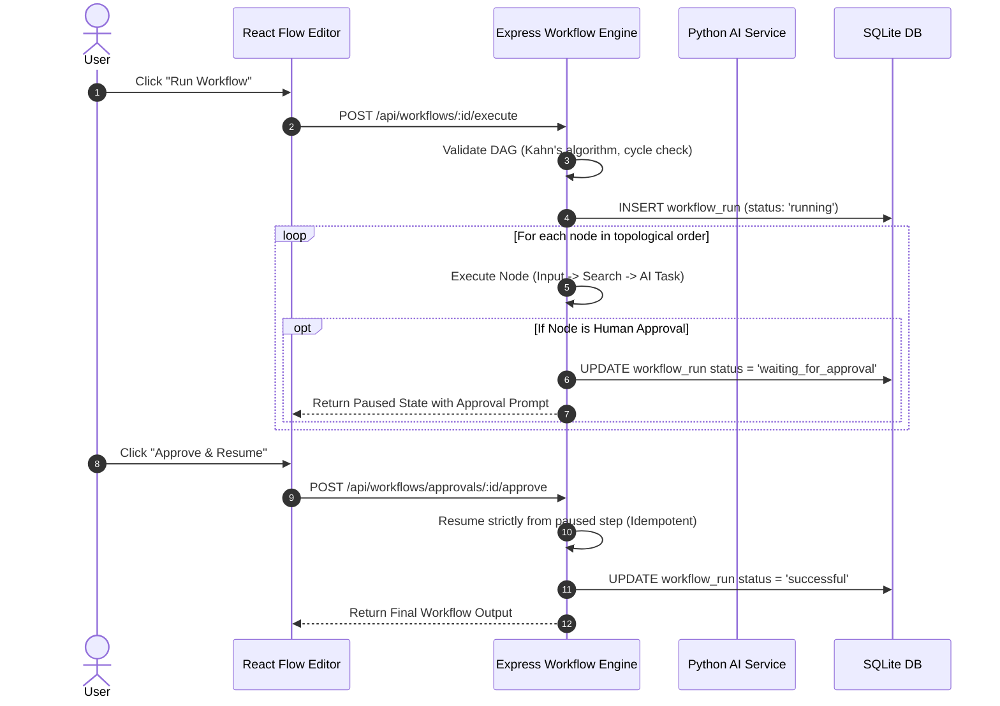

# ORBIT AI — System Architecture & Data Flow

## 1. Executive Architectural Overview

**ORBIT AI** is an AI-powered knowledge, bounded agent, and visual workflow automation workspace designed specifically for local AI engineering and hands-on learning.

The platform employs a strict **3-Tier Decoupled Architecture**:

```
+---------------------------------------------------------------+
|                      Vite React Frontend                      |
|            (Pure JavaScript ES6+ / Dark Navy UI)              |
|        Knowledge Hub | Agent Playground | Workflow Studio     |
|              Runs Trace | Settings & System Health            |
+-------------------------------+-------------------------------+
                                |  HTTP (via Vite Proxy /api)
                                v
+---------------------------------------------------------------+
|                   Node.js Express Backend                     |
|           (Main Application Gateway & Persistence)            |
|   Controllers | Services | Workflow DAG Engine | Evaluation   |
|                                                               |
|   +-------------------------------------------------------+   |
|   |            SQLite Database (WAL Mode)                 |   |
|   |  documents | chunks | agent_runs | workflow_runs      |   |
|   +-------------------------------------------------------+   |
+-------------------------------+-------------------------------+
                                |  Internal HTTP (:8000)
                                v
+---------------------------------------------------------------+
|                   Python FastAPI AI Service                   |
|               (Document RAG & Model Abstraction)              |
|   Document Extractor (PDF/TXT/MD) | Overlapping Chunker       |
|   TF-IDF Keyword Retriever | Bounded Agent & Tool Registry   |
|                                                               |
|   +--------------------------+   +------------------------+   |
|   |  Demo Provider (Default) |   |  Ollama Provider (LLM) |   |
|   |  Deterministic Extractive|   |  Local localhost:11434 |   |
|   +--------------------------+   +------------------------+   |
+---------------------------------------------------------------+
```

---

## 2. Core Architectural Principles

### A. Separation of Concerns
1. **The Express Backend owns application state**: Workflows, run traces, evaluation metrics, document metadata, and chunk storage belong to SQLite managed by Express.
2. **The Python AI Service is stateless and internal**: It exposes pure compute endpoints (text extraction, TF-IDF ranking, prompt generation, tool execution). Browser clients **never** speak directly to the Python service.
3. **No TypeScript**: Written entirely in clean, readable standard JavaScript ES modules (`.jsx` / `.js`) and Python 3.11+.

### B. Two-Tier AI Execution (Demo vs. Ollama)
- **Demo Mode (Default)**: Zero GPU and zero cloud credentials required. Utilizes transparent mathematical TF-IDF keyword ranking, sentence-level extractive summarization, and schema-bounded tool execution.
- **Ollama Mode**: Interacts with a local LLM daemon (e.g., `llama3`, `mistral`, `phi3`) over HTTP. When unavailable, it returns a clear descriptive error rather than generating fake responses.

### C. Bounded Safety Guardrails
- **No Unrestricted Code/Shell Execution**: AI agents and workflow nodes are strictly forbidden from running arbitrary shell commands, raw SQL, or filesystem writes.
- **Schema Validation**: Model arguments are validated against strict type definitions before tool execution begins.
- **Maximum Execution Depth**: Agent loops are hard-capped at 5 steps to eliminate runaway loops.

---

## 3. Data Flow Pathways

### Pathway 1: Document Ingestion & Chunking


### Pathway 2: Grounded Knowledge Retrieval & Q&A


### Pathway 3: Workflow Visual DAG Execution & Human Approval Pause


---

## 4. SQLite Data Model

| Table | Purpose | Primary Key | Key Relations |
| :--- | :--- | :--- | :--- |
| `documents` | Ingested source files and status | `id` (INTEGER) | 1-to-many `document_chunks` |
| `document_chunks` | Bounded text passages with page numbers | `id` (INTEGER) | Foreign key `document_id` (ON DELETE CASCADE) |
| `agent_runs` | Agent session records and prompt | `id` (TEXT) | 1-to-many `agent_steps` |
| `agent_steps` | Granular step traces (thought, tool, latency) | `id` (INTEGER) | Foreign key `run_id` (ON DELETE CASCADE) |
| `workflow_definitions` | Visual node & edge DAG specifications | `id` (TEXT) | 1-to-many `workflow_runs` |
| `workflow_runs` | Execution instances with status & approvals | `id` (TEXT) | Foreign key `workflow_id` |
| `workflow_steps` | Individual node execution output and duration | `id` (INTEGER) | Foreign key `run_id` (ON DELETE CASCADE) |
| `evaluations` | Deterministic benchmark test run results | `id` (TEXT) | Self-contained benchmark runs |
